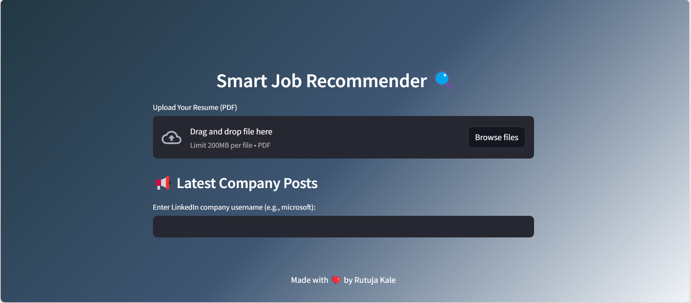

:

🔍 Smart Job Recommender System
A real-time job recommendation web app that fetches and displays job listings using the Adzuna Job Search API. Built with Python, Streamlit, and powered by AI-based job title extraction.

🚀 Features
🔎 Real-time job search based on user preferences

🧠 AI-powered job title extraction from natural language input

🌐 Fetches live jobs using the Adzuna Job Search API

📍 Filters by location and category

📋 Displays job title, description, location, and redirect link

📦 Tech Stack
Frontend: Streamlit

Backend: Python

APIs: Adzuna Job Search API, OpenAI (or similar for title extraction)

Other: .env for API key storage

🛠️ Setup Instructions
1. Clone the repo
bash
Copy
Edit
git clone https://github.com/yourusername/smart-job-recommender.git
cd smart-job-recommender
2. Create virtual environment (optional but recommended)
bash
Copy
Edit
python -m venv venv
source venv/bin/activate  # On Windows: venv\Scripts\activate
3. Install dependencies
bash
Copy
Edit
pip install -r requirements.txt
4. Add your API keys in .env
Create a .env file in the root folder and add:

ini
Copy
Edit
ADZUNA_APP_ID=your_adzuna_app_id
ADZUNA_APP_KEY=your_adzuna_app_key
💡 You can get your free API credentials from: https://developer.adzuna.com/

▶️ Run the App
bash
Copy
Edit
streamlit run main.py
The app will open in your browser at http://localhost:8501.

🧪 Test API Separately (Optional)
You can test if Adzuna API is working by running:

bash
Copy
Edit
python test_api.py
📷 Screenshots

(Add screenshots here if available to show the app interface)

📌 Notes
This app uses the free tier of Adzuna API, which has a daily request limit.

For long-term usage, apply for commercial or academic access on Adzuna.

You can replace the AI title extraction logic with OpenAI, Cohere, or a custom-trained model.

👨‍💻 Author
Rutuja
Connect on LinkedIn
Project built for learning and open-source contribution!

